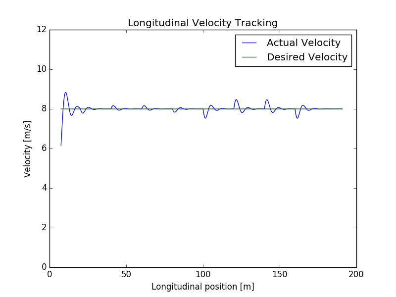

# ME131 Lab 2 Deliverables
### Simulating Kinematic Models in ROS

* Task 2 (c)
  * `bike_model.py` with the discretized forward Euler kinematic bicycle model implemented.
```python
from numpy import sin, cos, tan, arctan, array, dot
from numpy import sign, argmin, sqrt, abs, pi
import rospy

def bikeFE(x, y, psi, v, a, d_f, a0,m, Ff, theta, ts):
    """
    process model
    """
    # external parameters
    l_f = 1.5
    l_r = 1.5
    g = 9.81

    # incline_rad = (theta*pi)/180

    # external forces calculation
    Fg = m*g*sin(theta)    
    Fd = a0 * v**2
    F_ext = -Ff-Fd-Fg

    # compute slip angle
    beta = arctan((l_r / (l_r + l_f))*tan(d_f))

    # compute next state
    x_next = x + ts*(v*cos(psi + beta))
    y_next = y + ts*(v*sin(psi + beta))
    psi_next = (v / l_r)*sin(beta)
    v_next = v + ts*(a + (F_ext / m))

    return array([x_next, y_next, psi_next, v_next])
```

* Task 2 (d)
  * `controller.py` PID controller and its tuned gains.
```python
#!/usr/bin/env python

import rospy
import time
from barc.msg import ECU
from labs.msg import Z_DynBkMdl 
	
# initialize state
x = 0
y = 0
v_x = 0
v_y = 0
	
# ecu command update
def measurements_callback(data):
	global x, y, psi, v_x, v_y, psi_dot
	x = data.x
	y = data.y
	psi = data.psi 
	v_x = data.v_x 
	v_y = data.v_y 
	psi_dot = data.psi_dot
	 	
# Insert your PID longitudinal controller here: since you are asked to do longitudinal control,  the steering angle d_f can always be set to zero. Therefore, the control output of your controller is essentially longitudinal acceleration acc.
# ==========PID longitudinal controller=========#
class PID():
	def __init__(self, kp=1, ki=1, kd=1):
		self.kp = kp
		self.ki = ki
		self.kd = kd
		self.integrator = 0
		self.error_prev = 0

	def acc_calculate(self, speed_reference, speed_current):

		self.integrator += self.error_prev
		error_current = speed_reference-speed_current

		acc = self.kp*(error_current) + self.ki*(self.integrator) + self.kd*(error_current - self.error_prev)

		self.error_prev = error_current

		return acc
# ==========end of the controller==============#
	
# controller node
def controller():
	# initialize node
	rospy.init_node('controller', anonymous=True)
	
	# topic subscriptions / publications
	rospy.Subscriber('z_vhcl', Z_DynBkMdl, measurements_callback)
	state_pub = rospy.Publisher('ecu', ECU, queue_size = 10)
	
	# set node rate
	loop_rate = 50
	dt = 1.0 / loop_rate
	rate = rospy.Rate(loop_rate)
	t0 = time.time()
	
	# set initial conditions 
	d_f = 0
	acc = 0
	
	# reference speed 
	v_ref = 8 # reference speed is 8 m/s
	
	# Initialize the PID controller with your tuned gains
	PID_control = PID(kp=5, ki=1, kd=3)
	
	while not rospy.is_shutdown():
		# acceleration calculated from PID controller.
		acc = PID_control.acc_calculate(v_ref, v_x)

		# steering angle
		d_f = 0.0

		# publish information
		state_pub.publish( ECU(acc, d_f) )

		# wait
		rate.sleep()
	
if __name__ == '__main__':
	try:
		controller()
	except rospy.ROSInterruptException:
		pass
```

* Task 2 (j)
  * Submit a plot using the `plot.py` script after tuning the gains in the cruise controller



* Teleoperation via Keyboard
  * Keyboard control of the simulated vehicle:
    * https://drive.google.com/open?id=1UDEUumB0B6LlSTTGFk-k7HKpjTBvON5S
* `rqt_graph` during teleoperation


​	I used the teleop_twist_keyboard ROS package recommended in the lab instructions to interpret keyboard input, by default this node publishes to `/cmd_vel`. I left that node publishing to `/cmd_vel` and created my own `/barc_teleop` node which subscribes to `/cmd_vel`, takes the pertinent inputs, and maps then to the `/ecu` topic. The provided simulator node takes these messages and again remaps them appropriately for car viewer GUI.

   * Teleoperation launch file
        * Note this launch file does not include the teleoperation node as we'll need that in its own terminal for keyboard input, I run `rosrun teleop_twist_keyboard teleop_twist_keyboard.py` to initialize the teleop_twist node.
        * It also does not include the car trajectory viewer as it requires python2 and I have configured my system to employ python3 by default, I run that node separately with `python2 view_car_trajectory.py`.

```xml
<launch>
    <!-- SYSTEM MODEL -->
    <!-- vehicle parameters -->
    <param name="mass" type="double" value="2000" />

    <!-- control parameters -->
    <param name="air_drag_coeff" type="double" value="0.01308" />
    <param name="friction" type="double" value="0.01711" />

    <!-- Keyboard Relay -->
    <node pkg="labs" type="car_teleop.py" name="barc_teleop" />

    <!-- Simulator -->
    <node pkg="labs" type="vehicle_simulator.py" name="simulator" />

</launch>
```


