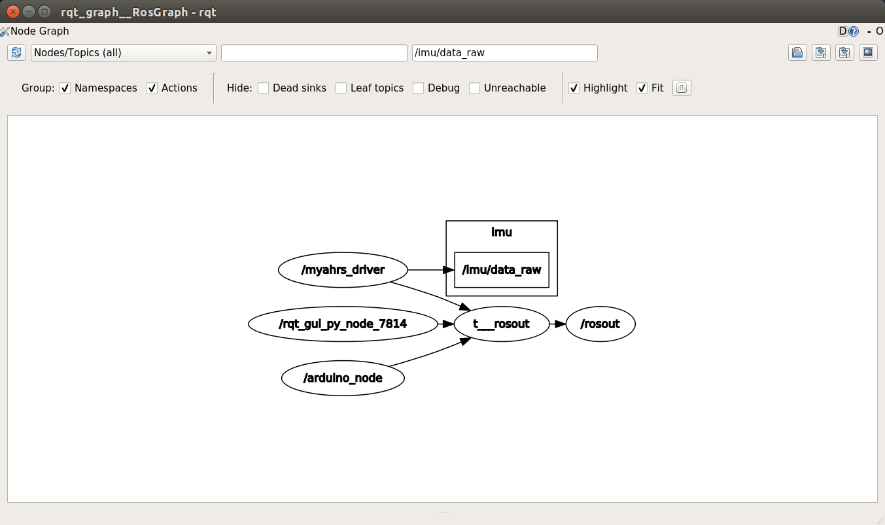

# ME131 Lab3 Deliverables

* Task 6.7 (ROS Architecture)
  * `rqt_graph` of BARC IMU and actuators topics and nodes.



* Task 7.1 (rostopic pub)

  * We check the rosmsg fields with

    ```
    $ rosmsg info barc/ECU
    float32 motor
    float32 servo
    ```

  * The motor and servo commands are PWM microsecond commands in the range [1000, 2000]. 1500 corresponds to zero torque for the motor and 1600 gives a comfortable forward velocity. We are given that the steering servo is limited to +/-45 degree range of motion which maps to [1200, 1800] PWM. Linearly interpolating, we find a command of 1700 would steer to the left by 30 degrees. The command we used was:

     `rostopic pub --once /ecu_pwm barc/ECU "motor: 1600 servo: 1700"`

    rostopic pub publishes messages to a topic, the --once flag indicates it should send that command once and not repeat it, then we specify the topic name, message type, and finally fill the fields with our command.

* Task 8.1 (rqt_plot of IMU for determining body axis)
  * BARC car axes

  

  * Values from the accelerometer while the vehicle is resting still on a table should be

  ```
  a_x = 0, a_y = 0, a_z = 9.81
  ```

  * The large offset in the z direction exists because the accelerometer (as with most MEMS accelerometers) measures "proper acceleration", so the effects of gravity are represented in the data. The accelerometer would read all zeros if the vehicle was in a free fall. 

* Task 8.2 (Angular Velocity Measurements)
  * (See the above diagram for labels) these axes do respect the right hand rule.